# landmasterlibrary


This library is create by kinkinbeer135ml.

# Installation

```bash
pip install git+https://github.com/landmaster135/landmasterlibrary.git
```

# Importation

```python
import * from landmasterlibrary
```

 # Modules

1. config.py
2. generaltool.py
3. morph_analysis.py
4. text_replacer.py

# Functions in each Module

## generaltool.py

- get_str_repeated_to_mark
- output_log
- get_str_from_list
- get_obj_from_yaml
- get_value_from_yaml
- get_src_path_from_test_path
- get_indices_by_seperators
- get_words_by_indices
- get_words_by_seperators
- remove_spaces_at_head_and_tail
- remove_tail_sapces
- remove_head_sapces
- get_functions_in_python_file
- get_words_in_lines_by_head_and_tail
- printfunc

### morph_analysis.py


## text_replacer.py

- make_voicedsound
- main

# Usage by `console_scripts`

<!-- You can use like these by `__name__ == "__main__"`. -->

You can use like these by `console_scripts`.

## 💼 &nbsp; generaltool

- printfunc

```bash
python file_list_getter.py '/Users/landmaster/Downloads/test_folder' 'png'
```

example

```bash
printfunc /usr/local/lib/python3.8/dist-packages/landmasterlibrary/generaltool.py '###'
```

->

```shell
============ functions list: start ============
### get_str_repeated_to_mark
### output_log
### get_str_from_list
### get_obj_from_yaml
### get_value_from_yaml
### get_src_path_from_test_path
### get_indices_by_seperators
### get_words_by_indices
### get_words_by_seperators
### remove_spaces_at_head_and_tail
### remove_tail_sapces
### remove_head_sapces
### get_functions_in_python_file
### get_words_in_lines_by_head_and_tail
### printfunc
============ functions list: end ============
```

***

# General Diagram


# Each Dependencies

## config.py

## generaltools.py

```mermaid
classDiagram
  get_str_repeated_to_mark <|-- get_str_by_zero_padding
  get_obj_from_yaml <|-- get_value_from_yaml
  get_src_path_from_test_path <|-- read_txt_lines
  remove_empty_items <|-- read_txt_lines
  get_src_path_from_test_path <|-- read_csv_lines
  remove_empty_items <|-- read_csv_lines
  get_indices_by_seperators <|-- get_indcies_containing_words
  get_indices_by_seperators <|-- get_words_by_seperators
  get_words_by_indices <|-- get_words_by_seperators
  remove_spaces_at_head_and_tail <|-- get_words_by_seperators
  remove_tail_sapces <|-- remove_spaces_at_head_and_tail
  remove_head_sapces <|-- remove_spaces_at_head_and_tail
  remove_tail_sapces <|-- remove_tail_sapces
  remove_head_sapces <|-- remove_head_sapces
  output_log <|-- get_text_in_file
  get_str_repeated_to_mark <|-- get_text_in_file
  get_text_in_file <|-- get_functions_in_python_file
  get_words_in_lines_by_head_and_tail <|-- get_functions_in_python_file
  output_log <|-- get_words_in_lines_by_head_and_tail
  get_str_repeated_to_mark <|-- get_words_in_lines_by_head_and_tail
  remove_head_sapces <|-- get_words_in_lines_by_head_and_tail
  output_log <|-- get_words_in_lines_by_head_and_tail
  get_str_repeated_to_mark <|-- get_words_in_lines_by_head_and_tail
  output_log <|-- get_func
  get_str_repeated_to_mark <|-- get_func
  get_functions_in_python_file <|-- get_func
  get_func <|-- get_func
  output_log <|-- get_func
  get_str_repeated_to_mark <|-- get_func
  get_func <|-- print_funcs
  get_text_in_file <|-- print_depends
  get_str_of_head_or_tail_by_extension <|-- print_depends
  get_str_of_head_or_tail_by_extension <|-- print_depends
  get_func <|-- print_depends
  get_words_in_lines_by_head_and_tail <|-- print_depends
  get_mark_of_not_function_statement <|-- print_depends
  get_funcs_in_text <|-- print_depends
  get_func <|-- print_depends
  print_depends <|-- print_depends_on_mermaid
  class get_str_repeated_to_mark{
  }
  class get_str_by_zero_padding{
  }
  class output_log{
  }
  class get_str_from_list{
  }
  class get_obj_from_yaml{
  }
  class get_value_from_yaml{
  }
  class get_src_dir_path_from_test_path{
  }
  class get_src_path_from_test_path{
  }
  class read_txt_lines{
  }
  class read_csv_lines{
  }
  class get_indices_by_seperators{
  }
  class get_indcies_containing_words{
  }
  class get_words_by_indices{
  }
  class get_words_by_seperators{
  }
  class remove_spaces_at_head_and_tail{
  }
  class remove_tail_sapces{
  }
  class remove_head_sapces{
  }
  class replace_by_words{
  }
  class get_text_in_file{
  }
  class get_funcs_in_text{
  }
  class get_functions_in_python_file{
  }
  class get_words_in_lines_by_head_and_tail{
  }
  class get_str_of_head_or_tail_by_extension{
  }
  class get_mark_of_not_function_statement{
  }
  class count_mermaid_lines{
  }
  class get_mermaid_elements{
  }
  class append_items{
  }
  class remove_empty_items{
  }
  class get_files_by_extensions{
  }
  class generate_cron_from_datetime_now{
  }
  class get_func{
  }
  class print_funcs{
  }
  class print_depends{
  }
  class print_depends_on_mermaid{
  }
```



## morph_analysis.py


